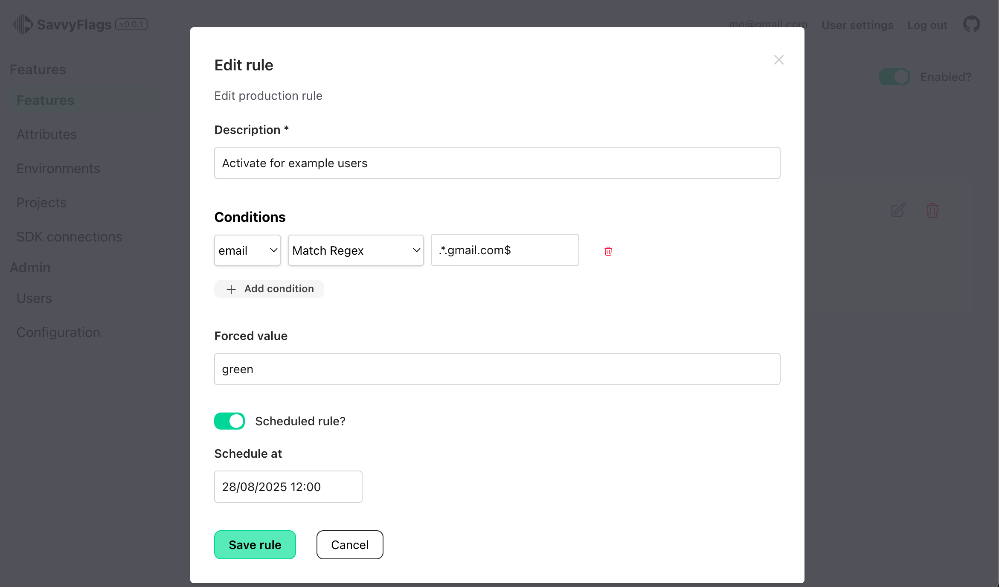

_This project is a POC to create a self hosted solution to manage feature flags powered by Elixir / Phoenix. Not production ready... yet!_

# SavvyFlags

Feature flag management application using Elixir / Phoenix.

## Requirements

- Postgresql > 14
- Elixir 1.17
- Erlang 27

## Features

- [x] Multi environments
- [x] Multi projects
- [x] Attributes management
  - [x] Remote attribute
- [x] User management
  - [x] Enforce MFA
  - [x] Feature flags restriction (per project, flags, environments)
- [x] Feature management
  - [x] Feature rule
    - [x] Sortable
  - [x] Feature rule conditions
    - [ ] Sortable
- [x] SDK connections
  - [x] Plain rules
  - [x] Remote evaluation
  - [x] Caching
  - [x] SSE
- [ ] other coming soon...
- [ ] SDK
  - [ ] js - https://github.com/StephaneRob/savvyflags-js (WIP)
  - [ ] React - coming soon ...
  - [ ] Elixir - coming soon ...
  - [ ] Ruby - coming soon ...

## Development

To start your Phoenix server:

- Run `mix setup` to install and setup dependencies
- Start Phoenix endpoint with `mix phx.server` or inside IEx with `iex -S mix phx.server`

- `export PLUG_EDITOR="vscode://file/__FILE__:__LINE__"` if you want to use "Jump to file"

Now you can visit [`localhost:4000`](http://localhost:4000) from your browser.

Ready to run in production? Please [check our deployment guides](https://hexdocs.pm/phoenix/deployment.html).
